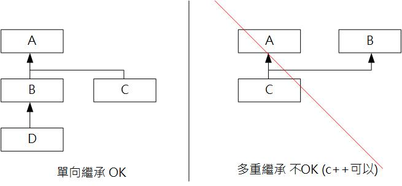

# Class Note 0326

## Static

### Memory Allocation

各個物件擁有的資料彼此獨立，佔用不同的記憶體空間。

```java
class Human{
    static int total = 0;  // 紀錄總人數
    Sring name;
    int age;
    int height;
    Human(String str){
        name=str;
        total++;  // 每建立一個Human物件，即對總人數+1
    }// end of constructor(String)
}// end of class Human

```

### static variable

> 這個變數不是屬於**物件** 而是**類別**

代表會多次使用的物件，當class被讀取的時候，static variable會被馬上分配再class area內

只有static會在compile的時候放在machine code的最前面

```java
class TestPerson{
  String name;
  int age=18;
  static studentNum = 0;

  //static variable, won't be repetitively created
  static String college = "NCKU";
}
```

### static method

Static Method 屬於class，而不是object

可以直接存取、改變static資料

## Override

子類別可以覆寫父類別的方法內容，使該方法擁有不同於父類別的行為

> Restrictions:
>
> * 用final修飾的方法無法被覆寫
> * 方法名稱、回傳型態、參數個數必須相同
> * 子類別方法開放權限不得小於父類別的方法(如果父是public, 子就不能是private)

## Method Overloading

同一個class中，定義多個名稱相同，但parameter不同的方法

## Polymorphism & Casting

父類別可以透過子類別延伸成多種型態

`class 子類別 extends 父類別`

```java
//Super Class
class Animal {
    public void makeSound() {
        System.out.println("Some generic sound");
    }
}
//Sub Class 1
class Dog extends Animal {
    public void makeSound() {
        System.out.println("Bark");
    }

    public void fetch() {
        System.out.println("Dog fetches");
    }
}
//Sub Class 2
class Cat extends Animal {
    public void makeSound() {
        System.out.println("Meow");
    }

    public void scratch() {
        System.out.println("Cat scratches");
    }
}
public class TestCasting {
    public static void main(String[] args) {
        Animal myAnimal = new Dog(); // Upcasting, implicitly
        myAnimal.makeSound(); // Calls the overridden method in Dog
  
        // Downcasting, explicitly
        if (myAnimal instanceof Dog) {
            Dog myDog = (Dog) myAnimal;
            myDog.fetch(); // Now we can access Dog-specific methods
        }

        // Attempting to use Cat-specific methods will require another instance
        myAnimal = new Cat(); // Upcasting, implicitly
        myAnimal.makeSound(); // Calls the overridden method in Cat

        // Downcasting, explicitly
        if (myAnimal instanceof Cat) {
            Cat myCat = (Cat) myAnimal;
            myCat.scratch(); // Now we can access Cat-specific methods
        }
    }
}
```

> instanceOf --> 用來檢查左邊是不是**右邊的子類別**

## UpCasting & DownCasting

透過轉型，你實際上並沒有更改物件本身，而只是對其進行了不同的標記。

* 如果實作了一隻貓並將其UpCasting為動物，這個不會停止成為貓。它仍然是一隻貓，但是它被當作任何其他動物對待，並且它的**貓的屬性被隱藏**，直到再次將其向下轉型到貓為止。
* 子類別一定可以轉型為母類別

```java
Cat c1 = new Cat()
Animal a = c1;//upcasting Cat to Animal
Cat c2 = (cat) a;//DownCasting to Cat
```

> 僅記向下轉型不一定會成功，如果這個c2其實是Dog的話，就會throw ClassCastException 的錯誤資訊
>
> 它能夠被compile，但是執行期間會throw這個error

### Automatic UpCasting

```java
public static void bark(Animal a){
    System.out.println("you barked the "+a);
}
Cat c = new Cat();		 
Dog d = new Dog();		 
bark(c); // automatically upcast to an Animal
bark(d); // automatically upcast to an Animal
```

## Super 呼叫父類別已經建立好參數的method

```java
class Animal{
  //super class
  String getInfo(){
    return "身高： "+height+"重量: "+weight;
  }
}
class Dog extends Animal{
  //sub class
  String color;
  String getInfo(){
    return super.getInfo()+"毛色: "+this.color;
  }
}
```

## Initialize by layers  (Constructor)

```java
class A{
    A(){
        System.out.println("這裡是A的建構子");
    }
}
class B extends A{
    B(){
        System.out.println("這裡是B的建構子");
    }
}
class C extends B{
    C(){
        System.out.println("這裡是C的建構子");
    }
}
```

執行結果：

> 這裡是A的建構子
>
> 這裡是B的建構子
> 這裡是C的建構子

## InstanceOf

* 用來檢查左邊的東西是不是**右邊東西的子類別**

```java
MyDog instanceOf Animal //-> true, UpCasting
myAnimal instanceOf Dog //-> false, DownCasting
```
