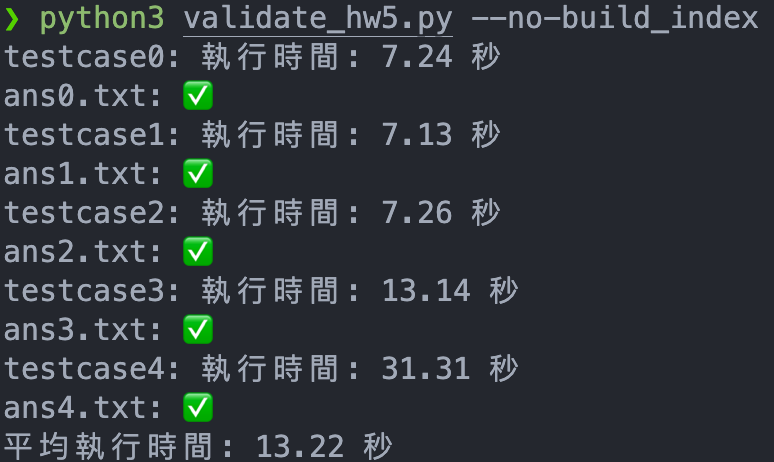
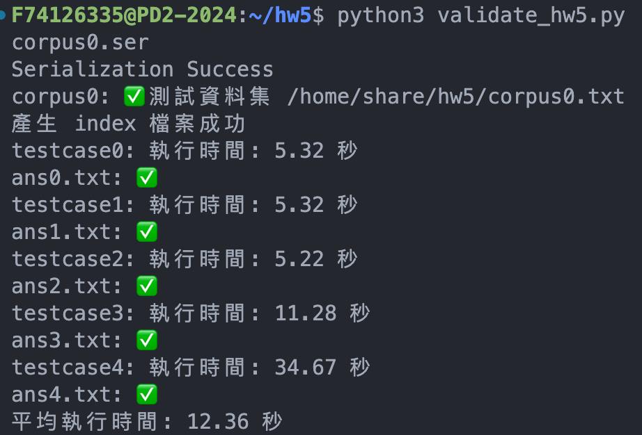

****# homework 5

## Description

### 前言

hw4是利用Trie的資料結構，加速查詢和計算文字出現次數，最後得出tf_idf值。

測資為一系列對於不同文本號碼及查詢文字的資料。

### 正體

本次作業經由前次經驗，一樣有關tf_idf的計算。

測驗資料會給一串文字，文字之間可能會用 AND/OR 連接起來

`and AND land AND hand AND upecndlsbf` ，如果是AND，則找出存在這些資料的文本的交集，對於每個文本算出各個字串的tf_idf值，然後加總。

最後會給予數字n，輸出前n大的文本編號。

### 困難

作業要求要使用serialize/deserialize 的方式實作，如果將整個Trie List serialize ，則序列化後的檔案大小太大，deserialize 需要耗費非常多時間，再加上如果是在TFIDFSearch.java 計算tf_idf值，所有時間都會被算在內。

### 解決方法

1. 首先，針對找出有前n大tf_idf的文本，使用PriorityQueue，裡面的資料是map的entry。使用comparator定義排序方法為：先對value做descending排序，然後如有相同的話，對key做ascending排序。這樣一來不必對整個array做sort，除了自動排序之外，也可以只取前n個出來

```java
PriorityQueue<Map.Entry<Integer, Double>> pq = new PriorityQueue<>(
Comparator.comparing(Map.Entry<Integer, Double>::getValue).reversed().thenComparing(Map.Entry<Integer, Double>::getKey));
```

2. 對於serialize和deserialize太花時間，就不打算序列化Trie List，而是建立一個大小和Trie List一樣大的 ArrayList，其中放的是HashMap<Integer,Double>。在BuildIndex.java中，先算出所有tf_idf的可能性，然後新增進這個hashmap中。
   假設想要得知第50個文本對於"like"的tf_idf值，則只要` mp.get(50).get("like")` 就能得到值，省下計算時間。
   除此之外，也因為沒有序列化Trie List，而是hashmap的list，讓序列化後的檔案縮小非常多。

## 成果

Local 端



Server 端


